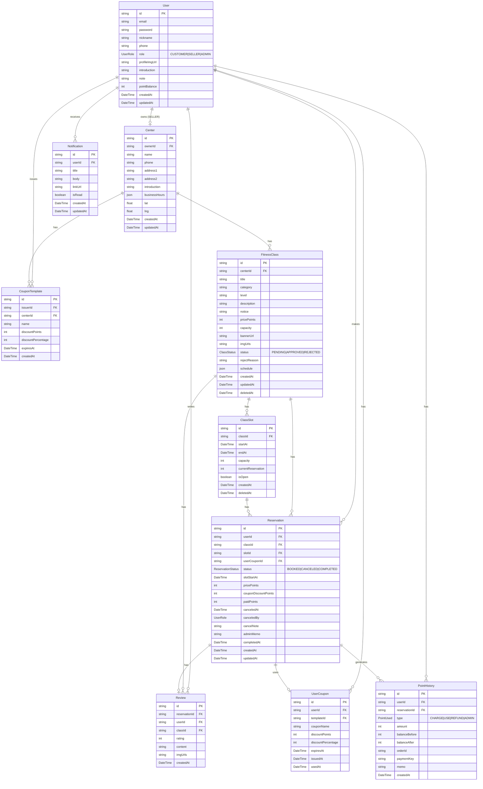

# FitMatch Backend

> FitMatch 피트니스 예약 플랫폼의 REST API 서버입니다.

🌐 **서비스 URL**: https://fit-match.co.kr
🔗 **Frontend Repository**: [fit-match-fe](https://github.com/jyoon00-cloud/fs9-fitness-reservation-fe)

## 목차

- [기술 스택](#기술-스택)
- [디렉토리 구조](#디렉토리-구조)
- [DB 스키마](#db-스키마)
- [API 명세](#api-명세)
- [로컬 실행](#로컬-실행)
- [환경변수](#환경변수)
- [배포](#배포)

---

## 기술 스택

| 구분                | 기술                  |
| ------------------- | --------------------- |
| **Runtime**         | Node.js 20 (ESM)      |
| **Framework**       | Express 5             |
| **Language**        | TypeScript 5          |
| **ORM**             | Prisma 7              |
| **DB**              | PostgreSQL (AWS RDS)  |
| **Auth**            | JWT (httpOnly Cookie) |
| **Validation**      | Zod                   |
| **File Upload**     | Multer + AWS S3       |
| **Test**            | Jest, Supertest       |
| **Package Manager** | pnpm                  |

---

## 디렉토리 구조

```
src/
├── config/          # 환경변수, Prisma 클라이언트
├── middlewares/     # 인증, 에러 핸들러, 로거, 업로드, 유효성 검사
├── modules/
│   ├── auth/        # 회원가입, 로그인, 토큰 갱신, 프로필
│   ├── center/      # 센터 CRUD
│   ├── class/       # 수업 CRUD, 슬롯 관리, 통계
│   ├── coupon/      # 쿠폰 템플릿, 발급
│   ├── notification/# 알림, SSE 실시간 스트림
│   ├── point/       # 포인트 내역, 충전, 정산
│   ├── reservation/ # 예약 생성/취소/완료
│   ├── review/      # 리뷰 CRUD
│   └── user/        # 어드민 유저 관리
├── tests/
│   └── integration/ # E2E 통합 테스트
├── types/           # 공통 타입
└── utils/           # 파일 업로드 유틸
prisma/
├── schema.prisma
├── migrations/
├── seed.ts          # 개발용 시드 데이터
└── seed.production.ts
```

---


## DB 스키마




---

## API 명세

[API 명세서 상세 보기](./api.md)

### Auth

| Method | Endpoint                | 설명             | 권한     |
| ------ | ----------------------- | ---------------- | -------- |
| POST   | `/api/auth/signup`      | 회원가입         | -        |
| POST   | `/api/auth/login`       | 로그인           | -        |
| POST   | `/api/auth/logout`      | 로그아웃         | 인증     |
| POST   | `/api/auth/refresh`     | 토큰 갱신        | -        |
| GET    | `/api/auth/me`          | 내 정보 조회     | 인증     |
| PATCH  | `/api/auth/customer/me` | 고객 프로필 수정 | CUSTOMER |
| PATCH  | `/api/auth/seller/me`   | 셀러 프로필 수정 | SELLER   |

### Centers

| Method | Endpoint           | 설명           | 권한   |
| ------ | ------------------ | -------------- | ------ |
| GET    | `/api/centers`     | 센터 목록 조회 | -      |
| GET    | `/api/centers/:id` | 센터 상세 조회 | -      |
| PATCH  | `/api/centers/:id` | 센터 정보 수정 | SELLER |

### Classes

| Method | Endpoint                              | 설명                       | 권한         |
| ------ | ------------------------------------- | -------------------------- | ------------ |
| GET    | `/api/classes`                        | 수업 목록 조회             | -            |
| GET    | `/api/classes/stats`                  | 수업 통계                  | ADMIN        |
| GET    | `/api/classes/:id`                    | 수업 상세 조회             | -            |
| POST   | `/api/classes`                        | 수업 등록                  | SELLER       |
| PATCH  | `/api/classes/:id`                    | 수업 수정                  | SELLER       |
| DELETE | `/api/classes/:id`                    | 수업 삭제                  | SELLER/ADMIN |
| PATCH  | `/api/classes/:id/approve`            | 수업 승인                  | ADMIN        |
| PATCH  | `/api/classes/:id/reject`             | 수업 반려                  | ADMIN        |
| POST   | `/api/classes/:id/slots`              | 슬롯 생성                  | SELLER       |
| POST   | `/api/classes/:id/slots/generate`     | 스케줄 기반 슬롯 자동 생성 | SELLER       |
| PATCH  | `/api/classes/:classId/slots/:slotId` | 슬롯 수정                  | SELLER       |
| DELETE | `/api/classes/:classId/slots/:slotId` | 슬롯 삭제                  | SELLER       |

### Reservations

| Method | Endpoint                         | 설명           | 권한     |
| ------ | -------------------------------- | -------------- | -------- |
| GET    | `/api/reservations`              | 예약 목록 조회 | 인증     |
| POST   | `/api/reservations`              | 예약 생성      | CUSTOMER |
| PATCH  | `/api/reservations/:id/cancel`   | 예약 취소      | 인증     |
| PATCH  | `/api/reservations/:id/complete` | 예약 완료 처리 | ADMIN    |

### Points

| Method | Endpoint             | 설명               | 권한     |
| ------ | -------------------- | ------------------ | -------- |
| GET    | `/api/points`        | 포인트 내역 조회   | 인증     |
| POST   | `/api/points/charge` | 포인트 충전 (토스) | CUSTOMER |
| POST   | `/api/points/admin`  | 포인트 수동 지급   | ADMIN    |
| GET    | `/api/points/sales`  | 셀러 매출 조회     | SELLER   |

### Coupons

| Method | Endpoint                    | 설명                | 권한         |
| ------ | --------------------------- | ------------------- | ------------ |
| GET    | `/api/coupons`              | 내 쿠폰 템플릿 조회 | SELLER/ADMIN |
| POST   | `/api/coupons`              | 쿠폰 템플릿 생성    | SELLER/ADMIN |
| PATCH  | `/api/coupons/:id`          | 쿠폰 수정           | SELLER/ADMIN |
| DELETE | `/api/coupons/:id`          | 쿠폰 삭제           | SELLER/ADMIN |
| POST   | `/api/coupons/give`         | 쿠폰 발급           | SELLER/ADMIN |
| GET    | `/api/coupons/user/:userId` | 유저 보유 쿠폰 조회 | ADMIN        |

### Reviews

| Method | Endpoint           | 설명           | 권한           |
| ------ | ------------------ | -------------- | -------------- |
| GET    | `/api/reviews`     | 리뷰 목록 조회 | -              |
| POST   | `/api/reviews`     | 리뷰 작성      | CUSTOMER       |
| PATCH  | `/api/reviews/:id` | 리뷰 수정      | CUSTOMER       |
| DELETE | `/api/reviews/:id` | 리뷰 삭제      | CUSTOMER/ADMIN |

### Notifications

| Method | Endpoint                    | 설명              | 권한  |
| ------ | --------------------------- | ----------------- | ----- |
| GET    | `/api/notifications`        | 알림 목록 조회    | 인증  |
| GET    | `/api/notifications/stream` | SSE 실시간 스트림 | 인증  |
| PATCH  | `/api/notifications/:id`    | 읽음 처리         | 인증  |
| DELETE | `/api/notifications/:id`    | 알림 삭제         | 인증  |
| POST   | `/api/notifications`        | 알림 생성         | ADMIN |

### Users (Admin)

| Method | Endpoint           | 설명           | 권한  |
| ------ | ------------------ | -------------- | ----- |
| GET    | `/api/users`       | 유저 목록 조회 | ADMIN |
| GET    | `/api/users/stats` | 유저 통계      | ADMIN |
| GET    | `/api/users/:id`   | 유저 상세 조회 | ADMIN |

---

## 로컬 실행

### 사전 요구사항

- Node.js 20+
- pnpm
- PostgreSQL

### 설치 및 실행

```bash
# 의존성 설치
pnpm install

# 환경변수 설정
cp .env.example .env

# Prisma 클라이언트 생성
pnpm prisma:generate

# DB 마이그레이션
pnpm prisma migrate dev

# 시드 데이터 적용 (선택)
pnpm prisma db seed

# 개발 서버 실행 (port 3000)
pnpm dev
```

### 테스트 실행

```bash
pnpm test
```

---

## 환경변수

| 변수명                   | 설명                          | 필수          |
| ------------------------ | ----------------------------- | ------------- |
| `DATABASE_URL`           | PostgreSQL 연결 URL           | ✅            |
| `JWT_SECRET`             | Access Token 서명 키          | ✅            |
| `JWT_REFRESH_SECRET`     | Refresh Token 서명 키         | ✅            |
| `JWT_EXPIRES_IN`         | Access Token 만료 시간        | 기본: `6h`    |
| `JWT_REFRESH_EXPIRES_IN` | Refresh Token 만료 시간       | 기본: `14d`   |
| `UPLOAD_TYPE`            | 업로드 방식 (`LOCAL` or `S3`) | 기본: `LOCAL` |
| `AWS_REGION`             | AWS 리전                      | S3 사용 시    |
| `AWS_ACCESS_KEY_ID`      | AWS 액세스 키                 | S3 사용 시    |
| `AWS_SECRET_ACCESS_KEY`  | AWS 시크릿 키                 | S3 사용 시    |
| `AWS_BUCKET_NAME`        | S3 버킷 이름                  | S3 사용 시    |
| `SERVER_URL`             | 서버 공개 URL                 | -             |

---

## 배포

GitHub Actions를 통해 `main` 브랜치에 push 시 자동 배포됩니다.

```
push to main
  ↓
pnpm install → prisma generate → tsc build
  ↓
SCP → EC2 업로드 (src + prisma + package.json)
  ↓
SSH → .env 복원 → pnpm install --prod
  ↓
prisma generate → prisma migrate deploy
  ↓
pm2 restart fitmatch-be
```

> 서버 접속 정보 및 환경변수는 GitHub Secrets(`BE_ENV`, `EC2_HOST`, `EC2_USER`, `EC2_SSH_KEY`)로 관리됩니다.
